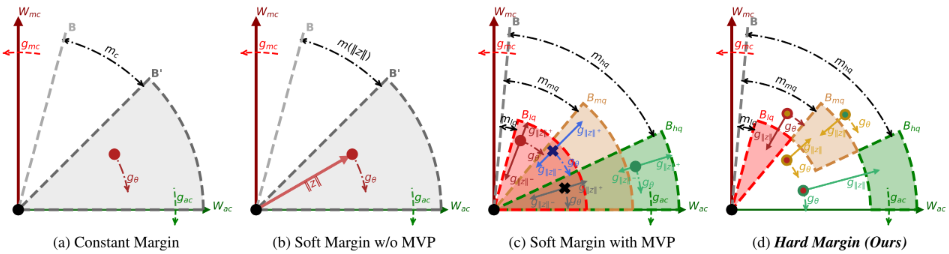
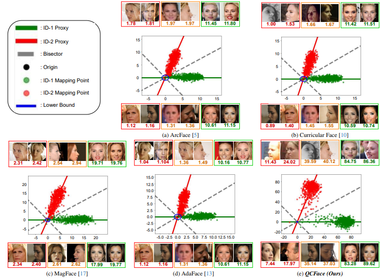
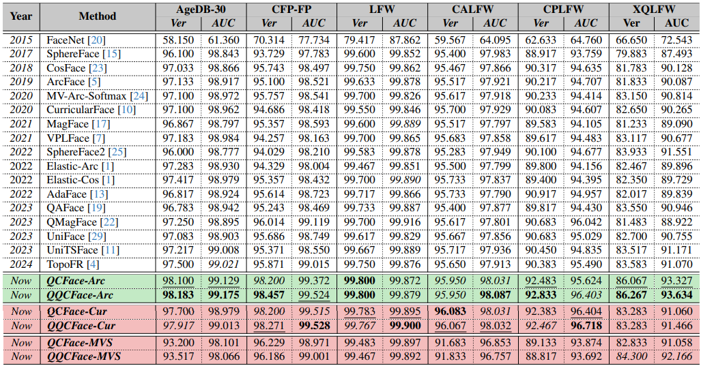
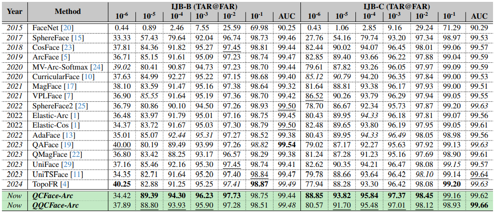
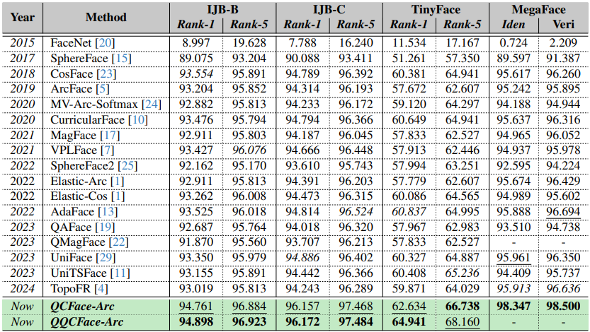

# QCFace: Image Quality Control for boosting Face Representation & Recognition (WACV2026-***Oral***)

[Duc-Phuong Doan-Ngo](), [Thanh-Dang Diep](https://scholar.google.com/citations?user=7y3IflQAAAAJ&hl=vi&oi=ao), [Thanh Nguyen-Duc](https://scholar.google.com/citations?user=i5ByiVcAAAAJ&hl=vi&oi=ao), [Thanh-Sach LE](https://scholar.google.com/citations?hl=vi&user=kHuYeWEAAAAJ&view_op=list_works&sortby=pubdate), and [Nam Thoai](https://scholar.google.com/citations?user=m2fgQRAAAAAJ&hl=vi&oi=ao)

## Affiliation
- [High Performance Computing Laboratory, Faculty of Computer Science and Engineering, Ho Chi Minh City University of Technology (HCMUT), VNU-HCM, Ho Chi Minh City, Vietnam.](https://hpcc.vn/)  
- [Data Science Laboratory, Faculty of Computer Science and Engineering, Ho Chi Minh City University of Technology (HCMUT), VNU-HCM, Ho Chi Minh City, Vietnam.]()  
- [Advanced Institute of Interdisciplinary Science and Technology, Ho Chi Minh City University of Technology (HCMUT), VNU-HCM, Ho Chi Minh City, Vietnam.]()    
- [School of Clinical Sciences, Monash University, Victoria, Australia.]()    
- [Department of Imaging, Monash Health, Victoria, Australia.]() 

---
[Paper](https://arxiv.org/abs/2510.15289)
**|**
[Supplementary Material]()
**|**
[Pretrained models]()

---
## Introduction
This repository is the official PyTorch implementation of ***QCFace: Image Quality Control for boosting Face Representation & Recognition***. ***QCFace*** achieves state-of-the-art performance in both recognizability representation and recognition ability compared to previous cutting-edges.

### Abstract
> Recognizability, a key perceptual factor in human face processing, strongly affects the performance of face recognition (FR) systems in both verification and identification tasks. Effectively using recognizability to enhance feature representation remains challenging. In deep FR, the loss function plays a crucial role in shaping how features are embedded. However, current methods have two main drawbacks: (i) recognizability is only partially captured through soft margin constraints, resulting in weaker quality representation and lower discrimination, especially for low-quality or ambiguous faces; (ii) mutual overlapping gradients between feature direction and magnitude introduce undesirable interactions during optimization, causing instability and confusion in hypersphere planning, which may result in poor generalization, and entangled representations where recognizability and identity are not cleanly separated. To address these issues, we introduce a hard margin strategy - Quality Control Face (QCFace), which overcomes the mutual overlapping gradient problem and enables the clear decoupling of recognizability from identity representation. Based on this strategy, a novel hard-margin-based loss function employs a guidance factor for hypersphere planning, simultaneously optimizing for recognition ability and explicit recognizability representation. Extensive experiments confirm that QCFace not only provides robust and quantifiable recognizability encoding but also achieves state-of-the-art performance in both verification and identification benchmarks compared to existing recognizability-based losses.

---
### Geometric interpretation between varying margin strategies in hypersphere planning
<p align="center">
  
</p>

---
## Code running

### Requirements
> - Platforms: Ubuntu 22.04.2 LTS, CUDA-11.8
> - Python 3.12
> - Pytorch: torch=2.7.1+cu118 and torchvision=0.22.1+cu118

```bash
# Install Requirements
pip install --no-cache-dir -r requirements.txt
```

### Training
Go to training folder.
```bash
cd train
```

In file ```run.sh```, please configure the arguments matching with your expected hardware and software setup.

```bash
BACKBONE=<your-backbone> # ir<x> for IResNet-<x> where x in {18, 50, 100}
LOSS_MODEL=<your-loss-function> # {qcface, qcface-cur, qcface-mv}
DATA_DIR=<data-root-path-1>,<data-root-path-2> # list of data root path separated with ','
WEIGHT_PATH=<your-pth-path> # weight path if you want to finetuning model
OUTPUT_DIR=<your-training-results-path> # using for save log file and weight files

mkdir -p ${OUTPUT_DIR}

# You can also config other arguments such as batchsize, learning rate, etc.
python train.py --arch ${BACKBONE} \
                --loss_model ${LOSS_MODEL} \
                --phase norm \
		        --data_dirs ${DATA_DIR} \
                --workers 16 \
                --epochs 12 \
                --start-epoch 0 \
                --batch-size 512 \
                --lr 0.01 \
                --momentum 0.9 \
                --weight-decay 5e-4 \
                --lr-drop-epoch 5 8 10 \
                --lr-drop-ratio 0.1 \
                --print-freq 100 \
                --pth-save-fold ${OUTPUT_DIR} \
                --pth-save-epoch 1 \
                --embed_dims 512 \
                --lambda_g 1.0 \
                --vis_mag 1 2>&1 | tee ${OUTPUT_DIR}/output.log

```

Let's run bash script.
```bash
bash ./run.sh
```

***Noted:*** We also provide a distributed training source which can be utilized to train with multiple GPUs. However, this source should be only referred since it has not validated before.

---
### Evaluation

#### High-quality benchmark
Go to high-quality validation folder.
```bash
cd validation_hq
```

In file ```eval.sh```, please configure the arguments matching with your expected hardware and software setup.

```bash
BACKBONE=<your-backbone>
LOSS_MODEL=<your-loss-function>
TRAIN_DATA=<name-of-data-used-for-training>
DATA_DIR=<root-folder-of-benchmark-datasets>
FEATURE_DIR=<location-used-to-save-extracted-feature>
WEIGHT_PATH=<your-pth-path>
RESULT_DIR=<location-used-to-save-results>
BATCH_SIZE=<batch-size>
DEVICE_ID=<id-of-bechmark-device>
```

Let's run bash script.
```bash
bash ./eval.sh
```

---
#### IJB benchmark
Go to IJB validation folder.
```bash
cd validation_mixed
```

In file ```eval_ijb.sh```, please configure the arguments matching with your expected hardware and software setup.

```bash
BACKBONE=<your-backbone>
LOSS_MODEL=<your-loss-function>
TRAIN_DATA=<root-folder-of-benchmark-datasets>
DATA_DIR=<root-folder-of-benchmark-datasets>
WEIGHT_PATH=<your-pth-path>
BATCH_SIZE=<batch-size>
DEVICE_ID=<id-of-bechmark-device>
SIMILARITY_METHOD=<similarity-score-calculator> # {cosine, qmf (qmagface), euclid}
```

***Noted:*** 
- If you only want to benchmark IJB-B or IJB-C individually, please commentize the other.
- If you utilize QMagFace as the similarity score calculator, please config alpha and beta in file ```similarity.py```. The initialized values is leveraged for our provided models.

Let's run bash script.
```bash
bash ./eval_ijb.sh
```

---
#### TinyFace benchmark
Go to TinyFace validation folder.
```bash
cd validation_lq
```

In file ```tinyface.sh```, please configure the arguments matching with your expected hardware and software setup.

```bash
BACKBONE=<your-backbone>
LOSS_MODEL=<your-loss-function>
TRAIN_DATA=<root-folder-of-benchmark-datasets>
DATA_DIR=<root-folder-of-benchmark-datasets>
WEIGHT_PATH=<your-pth-path>
BATCH_SIZE=<batch-size>
DEVICE_ID=<id-of-bechmark-device>
SIMILARITY_METHOD=<similarity-score-calculator> # {cosine, qmf (qmagface), euclid}
```

***Noted:*** 
- We also provide IJB-S benchmark source. However, it should be only referred since it has not validated before due to lack of dataset access.
- If you utilize QMagFace as the similarity score calculator, please config alpha and beta in file ```similarity.py```. The initialized values is leveraged for our provided models.

Let's run bash script.
```bash
bash ./tinyface.sh
```

---
## Experimental results

### Geometrical representation of the feature space optimized by MagFace, AdaFace and ***QCFace-Arc***
<p align="center">
  
</p>

---
### Verfification accuracy on High-quality bechmark datasets
<p align="center">
  
</p>

---
### Verfification accuracy on Mixed bechmark datasets
<p align="center">
  
</p>

---
### Identification accuracy
<p align="center">
  
</p>

---
## TODO
- [ ] Add pretrained model
- [ ] Add training log files


## Citation
```
@article{doan2025qcface,
  title={QCFace: Image Quality Control for boosting Face Representation \& Recognition},
  author={Doan-Ngo, Duc-Phuong and Diep, Thanh-Dang and Nguyen-Duc, Thanh and LE, Thanh-Sach and Thoai, Nam},
  journal={arXiv preprint arXiv:2510.15289},
  year={2025}
}
```

## License and Acknowledgement
We refer to codes from [MagFace](https://github.com/IrvingMeng/MagFace), [QMagFace](https://github.com/pterhoer/QMagFace), and [InsightFace](https://github.com/deepinsight/insightface). Thanks for their awesome works.
